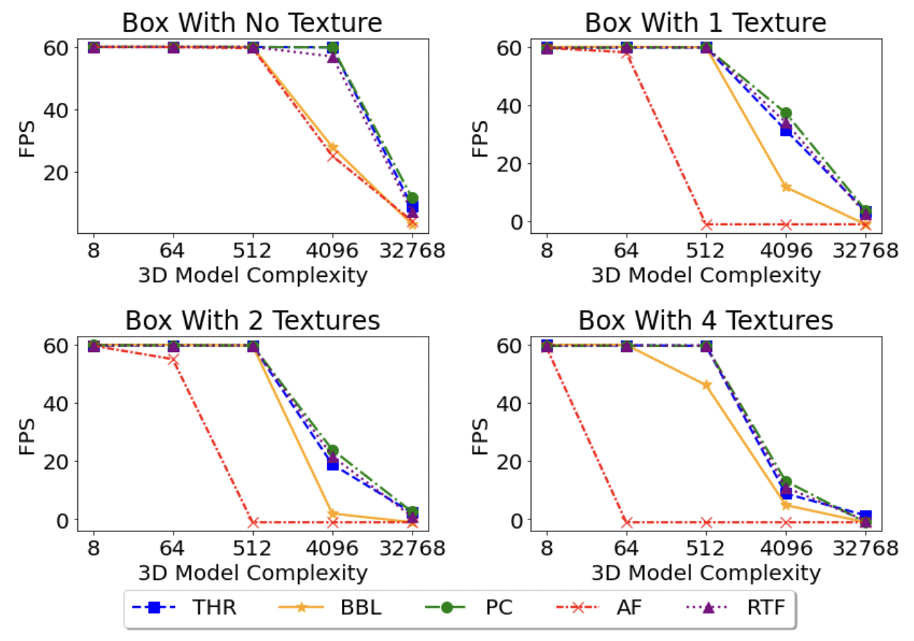

# WebXR
## Introdunction
we conduct the first empirical study of web-based XR. 

We select the seven most popular frameworks for mobile XR in browsers and investigate their current capacity for
XR by evaluating their runtime performance, including 3D rendering, camera capturing, and real-world understanding.

The seven chosen frameworks are as follows:

* **Three.js** is a Javascript 3D library that aims to create an easy-to-use, lightweight, cross-browser, general-purpose 3D library.
* **React-three-fiber** is a React renderer for three.js.
*  **Babylon.js** tends to create a powerful, beautiful, simple, and open game and rendering engine.
* **A-Frame** is a web framework for building virtual reality experiences, which makes 3D worlds with HTML and entity-component.
*  **Playcanvas** aims to provide a fast and lightweight Javascript game engine build on WebGL and GLTF.
* **AR.js** is a javascript framework that supports augmented reality functions, including image tracking, location-based AR, and marker tracking.
* **MindAR.js** is a framework for web-based augmented reality, which provides image tracking and face tracking functions.

The characteristics of frameworks for web-based XR is shown in the following table.

## How to use
Open different webpage on mobile device, the results such as first loading time and FPS will be logged to web dev tool, and detailed metrics such as CPU scripting and GPU usage overtime can be analysis through profiling.

Codes of evaluating seven frame works locate in `evaluteThree`, `evaluateReactThreeFiber`, `evaluvateBabylon`, `evaluateAframe`, evaluatePlaycanvas, `evaluateAR`, and `evaluateMindAR`. Enter these folders and you can see files for measuring VR and AR.

* `multigltf/multiobj/multifbx`: measure 3D rendering of gltf/obj/fbx models
* `multigltf-ar/multiobj-ar/multifbx-ar`: measure AR scene with gltf/obj/fbx models

You can change 3D model complexity by changing the number of 3D model rendered. You can also change models, the models locate in `gltf/obj/fbx` folders.

Codes in `detailedAnalysis` provide function for detailed analysis. Firstly, use web dev tool to profile and download the profiling result (a json file). Then exact information form the json file. `getUsageArray()` and `getGPUUsage()` get CPU scripting usage and GPU usage. `getNetworkTimes()` and `getImageDecodeTimes()` get start and end times of network transfering and image decoding.

## Main Results

We verify that large models can be simulated by multiple small models as long as they have similar model complexity. Therefore, we use boxes with different numbers of textures as small models and render them multiple times to simulate
different model complexity. For a single box, the number of textures range in [0,1,2,4], and the texture resolution is 2048 × 2048. The number of times the box will be reused for simulation ranges in [8,64,512,4096,32768].

We use a Pixel 6 mobile phone as our high-end device and Mi 10 as our low-end device. In addition, all experiments run on the Chrome browsers (version: 105.0.5195.17 dev 64 bit) on Android 12. We set up a server on a macOS laptop and used the phone as a client to request the website. As for the frameworks, we use the latest released version.

### 3D Loading

#### First loading times

The first loading times of different frameworks and different 3D model complexity:

#### Usage during loading

The CPU scripting and GPU usage of different frameworks during loading 4096 boxes with four textures
(8 boxes for A-Frame):

### 3D Rendering

#### FPS

FPS for different frameworks and different 3D model complexity:

#### Usage during rendering

The average CPU scripting usage and GPU usage of different frameworks:

### Camera Capturing

The number of well-performed scenarios for different frameworks:

Relationship between first loading time and FPS (not well-performed) with and without camera capturing:

### Time Left for Real-world UnderStanding

Average frame time (ms) of different frameworks and different 3D model complexity:

